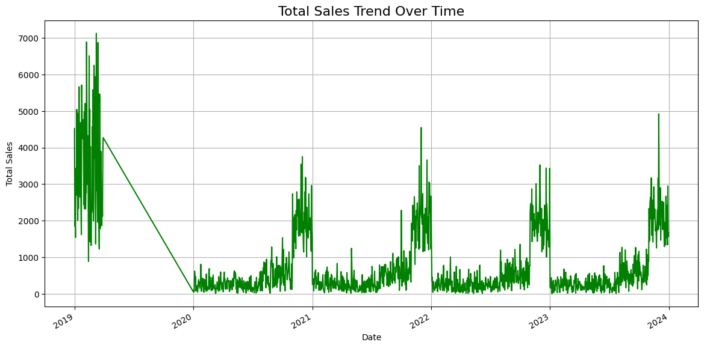

# Walmart Sales Strategy Dashboard — Portfolio Case Study

[](https://www.python.org/)
[](https://streamlit.io/)

> Retail analytics notebook turned into an interactive Streamlit BI dashboard with 7-day sales forecasting.

---

## Why I built this

Branch managers do not read 1,000-line notebooks. I built this to answer a practical question: **given transaction history, what should we do differently next week?** — not just what already happened.

## The challenge

- **Audience:** Insights buried in ETL scripts are invisible to non-technical reviewers.
- **Scope:** Moving from descriptive charts to a **"what next?"** forecaster added engineering complexity.
- **Product:** Filters (branch, category) had to feel instant — the dashboard is the deliverable, not the CSV.

## What I did

1. Cleaned and enriched retail transaction data (pricing, timestamps, profit margins).
2. Built **Streamlit dashboard** (`dashboard.py`) with live filters and Plotly charts.
3. Added **`SalesForecaster`** — 7-day revenue prediction from day-of-week and month features.
4. Documented **actionable strategies** — peak hours, category concentration, branch benchmarks.

## What I learned

- **Product beats code** for portfolio reviews — a clickable dashboard tells the story faster.
- **Predictive beats descriptive** — forecasting shifts the conversation from reporting to planning.
- Small bugs in presentation layer (e.g. Streamlit API typos) can hide good analysis — test the run path.

## How this leveled me up

| | |
|---|---|
| **Before** | I delivered static analysis and charts in notebooks |
| **After** | I can package analytics as interactive BI with forecasting |
| **Unlocked next** | Stakeholder-facing dashboards for any analytics or ML project |

## Demo / proof



```bash
git clone https://github.com/NguyenThuan-data/Walmart_Sales_Analysis.git
cd Walmart_Sales_Analysis
pip install -r requirements.txt
streamlit run dashboard.py
```

Open [http://localhost:8501](http://localhost:8501).

---

## Technical reference

### Actionable insights (from analysis)

- **Peak hours:** Transaction spike **3 PM – 8 PM** → dynamic staffing during "golden hours"
- **Profit concentration:** **Fashion** and **Home** drive majority of profit → bundle Health & Beauty as loss-leaders
- **Regional scaling:** **Bedford Branch** highest volume-to-staffing efficiency → template for other branches

### Predictive forecasting

`SalesForecaster` uses linear regression on daily aggregates (day-of-week, month) to project the next 7 days of revenue.

### Tech stack

Streamlit · Plotly · Pandas · NumPy · scikit-learn · PostgreSQL (SQLAlchemy, optional ETL path)

### Project structure

```text
Walmart_Sales_Analysis/
├── dashboard.py
├── forecaster.py
├── Walmart.csv
├── images/sale_trends.png
└── requirements.txt
```
